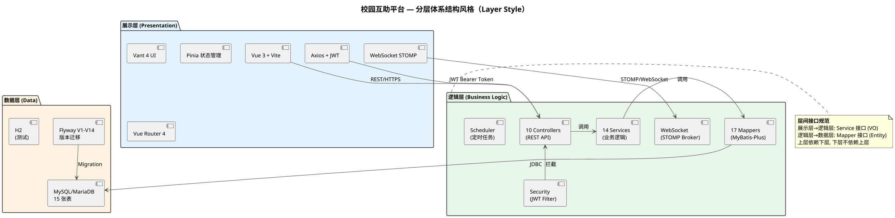
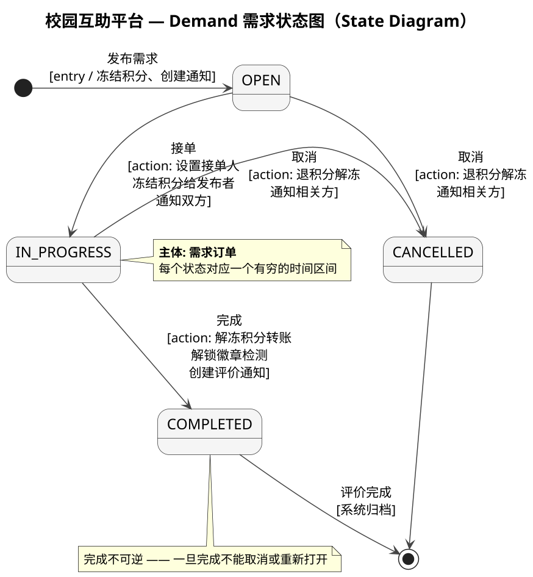
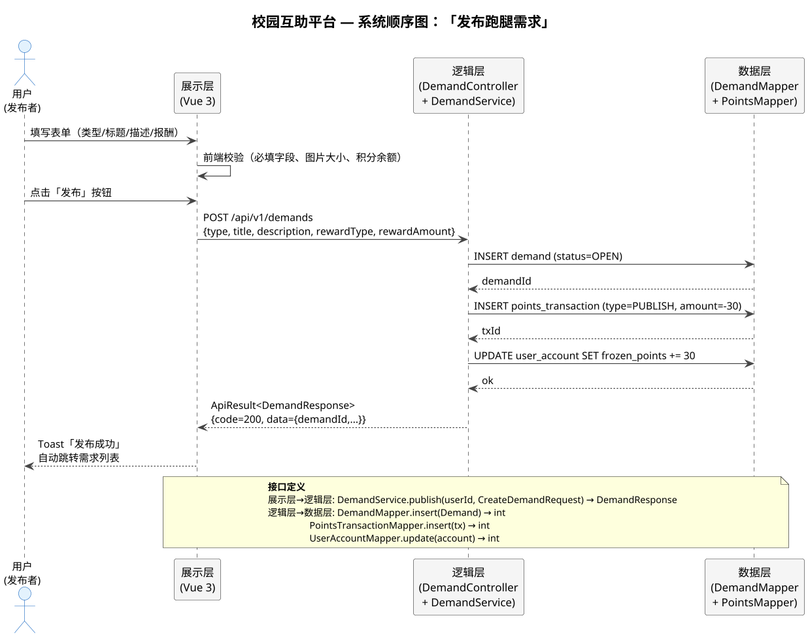

# 期末答辩 PPTX 生成 Prompt（给 GPT 5.5 网页版）

> **使用方式**：将此 prompt 全文复制粘贴给 GPT 5.5，**直接生成 `.pptx` 文件**（16:9 宽屏）。
>
> 由于 GPT 无法读取本地文件，所有 PlantUML 源码、团队信息、项目数据均已内嵌在此 prompt 中。

---

## 一、核心原则

1. **PPT 不是讲稿，字越少越好、字越大越好**——理论解释留给口述，PPT 只放关键词/图表/截图
2. **允许精简信息**——上述每页列出的详细条目仅供参考，你可以将冗余信息合并、删减、提炼为关键词，把细节压力转移给讲稿
3. **功能演示页每页一张桌面端截图**，底部顺手标注一行 HCI 关键词即可，不单独讲 HCI
3. **表格分到独立页面**
4. **PlantUML 图尽量铺满页面**
5. **不要用例图**、不要理论解释段落、不要话术批注
6. 颜色和排版由你自由发挥，以清晰可读为准

---

## 二、团队信息

| 角色 | 成员 | 职责 |
|------|------|------|
| 需求负责人 | 侯乔岳 | 功能规划、需求文档 |
| 架构负责人 | 杨佳兴 | 系统设计、数据库 Schema、API 设计 |
| 开发负责人和测试负责人 | 沈诺、胡皓轩 | 前后端开发、代码实现、测试用例、质量保证 |

- 团队名：不误正业
- 答辩人：沈诺（不要写"主讲人"前缀）
- 日期：2026 年 6 月

四人职责：
- 侯乔岳（需求负责人）：功能规划与需求文档 / 用户调研与用例编写 / 验收标准制定 / 需求优先级排序
- 杨佳兴（架构负责人）：系统架构设计 / 数据库 Schema 设计 / ADR 架构决策记录 / API 规范设计
- 沈诺（开发 & 测试负责人）：前后端全栈开发 / 243 测试用例编写 / CI/CD 流水线搭建 / HCI 交互细节落地
- 胡皓轩（开发 & HCI 设计）：需求功能设计 / HCI 交互设计 / 演示与展示

---

## 三、项目数据

- 15 张数据表（Flyway V1→V14）
- 57 个 REST API 端点 + 4 个 WebSocket 端点
- 18 条前端路由
- 243 个测试用例，全部通过
- 9 种成就徽章
- 10 个 Controller、14 个 Service、17 个 Mapper
- 6 种需求类型：跑腿代取 / 二手交易 / 组队匹配 / 失物招领 / 学习互助 / 其他

技术栈：
- 后端：Spring Boot 3.2.5 · MyBatis-Plus 3.5.6 · Spring Security + JWT · WebSocket STOMP · Flyway · MySQL
- 前端：Vue 3 (Composition API) · Vite 5 · Vant 4 · Pinia · Vue Router 4 · Axios
- CI/CD：GitHub Actions（Backend ~1m20s, Frontend ~24s）
- 部署：Nginx 反向代理 → /api/* 转发 Spring Boot :8080 · 其余转发 Vite :5173

---

## 四、PlantUML 图（本地 pre-render 为 PNG 后嵌入 PPT）

> ⚠️ 这些 .puml 文件已在本地，请先运行 `plantuml -tpng *.puml` 生成 PNG。PPT 中用占位方式嵌入（若 PNG 存在则嵌图，否则留灰色虚线框 + 文件名标注）。

### 4.1 分层架构图 — `architecture.png`



### 4.2 逻辑包图 — `packages.png`

```plantuml
@startuml
skinparam backgroundColor white
skinparam packageBackgroundColor #FAFAFA
skinparam packageBorderColor #333333
skinparam packageFontSize 15
skinparam componentFontSize 12
skinparam defaultFontSize 12
skinparam ArrowColor #666666
skinparam titleFontSize 18
scale 1.2

title 校园互助平台 — 逻辑包图（Package Diagram）

package "cn.seecoder.campushelp" #F5F5F5 {

  package "controller" as ctrl #E3F2FD {
    [UserController] [DemandController] [ChatController] [AdminController]
    [BadgeController] [EvaluationController] [NotificationController]
    [PointsController] [ReportController] [TeamMemberController]
  }

  package "service" as svc #E8F5E9 {
    [UserService] [DemandService] [ChatService] [AdminService]
    [BadgeService] [EvaluationService] [NotificationService]
    [PointsService] [ReportService] [FavoriteService] [TeamMemberService]
  }

  package "mapper" as mapper #FFF3E0 {
    [UserMapper] [DemandMapper] [ConversationMapper] [MessageMapper]
    [EvaluationMapper] [NotificationMapper] [PointsTransactionMapper]
    [DailyCheckinMapper] [ReportMapper] [TeamMemberMapper] [FavoriteMapper]
    [BadgeMapper] [UserBadgeMapper] [WornBadgeMapper]
    [UserAccountMapper] [PrivacyProfileMapper]
  }

  package "entity" as entity #FCE4EC {
    [User] [Demand] [Conversation] [Message] [Evaluation]
    [Notification] [PointsTransaction] [DailyCheckin] [Report]
    [TeamMember] [Favorite] [Badge/UserBadge\n/WornBadge]
    [UserAccount] [PrivacyProfile]
  }

  package "dto" as dto #F3E5F5 { [request/* (13个)] [response/* (10个)] }
  package "config" as config #ECEFF1 {
    [SecurityConfig] [WebSocketConfig] [CorsConfig]
    [WebMvcConfig] [MyBatisPlusConfig]
  }
  package "security" as sec #E0E0E0 { [JwtTokenProvider] [JwtAuthFilter] }
  package "common" as common #E0E0E0 { [ApiResult] [BusinessException] [GlobalExceptionHandler] }
}

ctrl ..> svc : «use»
ctrl ..> dto : «use»
svc ..> mapper : «use»
svc ..> dto : «use»
mapper ..> entity : «use»
sec ..> config : «use»

@enduml
```

### 4.3 设计类图 — `class_diagram.png`

```plantuml
@startuml
skinparam backgroundColor white
skinparam classBackgroundColor #FAFAFA
skinparam classBorderColor #333333
skinparam classFontSize 14
skinparam defaultFontSize 12
skinparam ArrowColor #555555
skinparam titleFontSize 18
scale 1.3

title 校园互助平台 — 设计类图（核心实体及关系）

class User {
  - userId: Long / studentId: String / name: String
  - avatar: String / role: String / status: Integer
  + register(req): User / login(id, pwd): LoginResponse / updateProfile(req): void
}

class UserAccount {
  - accountId: Long / userId: Long / password: String
  - pointsBalance: Integer / reputationScore: Double
  + freeze(amount): void / unfreeze(amount): void / recalcReputation(): void
}

class Demand {
  - demandId: Long / publisherId: Long / acceptorId: Long
  - type: String / title: String / description: String
  - status: DemandStatus / rewardType: RewardType / rewardAmount: Integer
  - attributes: JSON
  + publish(req): DemandResponse / accept(userId): DemandResponse
  + complete(): void / cancel(): void / edit(req): DemandResponse
}

enum DemandStatus { OPEN / IN_PROGRESS / COMPLETED / CANCELLED }

enum BadgeDefinition {
  FIRST_PUBLISH / FIRST_ACCEPT / TEN_COMPLETES / FIRST_FIVE_STAR
  HUNDRED_STARS / CHECKIN_30 / HELPER / FIRST_REPORT_SUCCESS / EASTER_EGG
}

class UserBadge {
  - id: Long / userId: Long / badgeKey: BadgeDefinition / earnedAt: DateTime
  + checkAndAward(userId, key): boolean / hasBadge(userId, key): boolean
}

class Evaluation {
  - evaluationId: Long / demandId: Long / evaluatorId: Long
  - targetId: Long / rating: Integer / content: String
  + create(req): Evaluation / update(evalId, req): void / getReputation(userId): Double
}

class Report {
  - reportId: Long / reporterId: Long / targetType: String
  - targetId: Long / reason: String / status: ReportStatus / adminNote: String
  + submit(req): Report / resolve(id, note): void
}

class Favorite {
  - id: Long / userId: Long / demandId: Long
  + add(userId, demandId): void / remove(userId, demandId): void
}

User "1" -- "1" UserAccount
User "1" -- "0..*" Demand
User "1" -- "0..*" Evaluation
User "1" -- "0..*" UserBadge
User "1" -- "0..*" Report
User "1" -- "0..*" Favorite
Demand "1" *-- "1..*" DemandStatus
Demand "1" -- "0..1" Evaluation
Report "1" -- "1" Demand
Favorite "1" -- "1" Demand

@enduml
```

### 4.4 需求状态图 — `state_diagram.png`



### 4.5 系统顺序图 — `sequence.png`



---

## 五、截图占位

> 截图由用户事后放入 `docs/final_demo/screenshots/`，全部桌面端。PPT 中请用灰色虚线框 + `[截图: xxx.png]` 文字占位。

| 文件名 | 对应页面 |
|--------|---------|
| `login.png` | 登录与首页 |
| `demand_list_desktop.png` | 需求广场 |
| `demand_publish.png` | 发布需求 |
| `demand_detail.png` | 需求详情 |
| `chat.png` | 私信聊天 |
| `badges.png` | 成就徽章 |
| `admin_dashboard.png` | 管理后台 |

---

## 六、幻灯片结构（25 页）

### Section 1 — 需求（Slide 1-5）

**Slide 1 — 封面**
- 校园互助服务平台 · 期末答辩
- 软件工程与计算 II · 人机交互
- 团队：不误正业 · 成员：侯乔岳 · 杨佳兴 · 沈诺 · 胡皓轩
- 沈诺 · 2026 年 6 月（不要写"主讲人："前缀）

**Slide 2 — 团队介绍**
- README 三列表格（角色/成员/职责）
- 四人卡片：侯乔岳（需求负责人）/ 杨佳兴（架构负责人）/ 沈诺（开发 & 测试负责人）/ 胡皓轩（开发 & HCI 设计），每张卡片列出 4 条职责

**Slide 3 — 项目概述**
- 5 个关键数字：15 张表 / 57 个 API / 18 条路由 / 243 个测试 / 9 种徽章
- 6 种需求类型：跑腿代取 / 二手交易 / 组队匹配 / 失物招领 / 学习互助 / 其他
- 技术栈两行（后端 + 前端）
- 9 个特性关键词：JWT 无状态认证 / 积分不可变账本 / WebSocket 实时通信 / 9 种成就徽章 / 响应式双视图 / 举报审核系统 / 悲观锁防超发 / Flyway 版本迁移 / 统一 ApiResult

**Slide 4 — 过程模型：敏捷开发**
- 4 条敏捷价值观
- P0→P4 五阶段时间线：团队组建 → 需求分析 → 体系结构 → 详细设计 → 编码测试（每阶段列出交付物）
- Sprint 执行策略要点

**Slide 5 — 需求分析**
- 需求三层次：业务需求 / 用户需求 / 系统需求（每层列出 3 条要点）
- 六种需求类型
- 功能性需求一行 / 非功能性需求一行

### Section Divider 1（Slide 6）
- 全页分隔：标题 "系统架构"，副标题 "体系结构设计 · 包结构 · 数据库设计"

### Section 2 — 架构（Slide 7-9）

**Slide 7 — 体系结构设计**
- 左侧：分层架构文字罗列——
  - 展示层：Vue 3 · Vite 5 · Vant 4 · Pinia · Vue Router 4 · Axios · 响应式双视图
  - 逻辑层：Spring Boot 3.2.5 · Spring Security + JWT · MyBatis-Plus 3.5.6 · WebSocket STOMP
  - 数据层：MySQL · Flyway V1→V14 · 单表继承 discriminator · 积分不可变账本 · 悲观锁 SELECT FOR UPDATE
- 右侧：4 个 ADR 关键架构决策——
  - 模块化单体 > 微服务（10 周交付、无分布式事务、可后续拆分）
  - JWT 无状态 > Session（跨域灵活、无需服务端存储）
  - 单表继承 > 多表继承（discriminator + JSON 列，避免多表 JOIN）
  - 悲观锁 > 乐观锁（积分强一致性、SELECT FOR UPDATE 防超发）

**Slide 8 — 包结构**
- `packages.png` 铺满页面
- 底部一行标注：`controller 10 · service 14 · mapper 17 · entity 16 · dto 12 · config 7`

**Slide 9 — 数据库设计**
- 5 个关键词：15 张表 / 单表继承 / 不可变账本 / 悲观锁 / UNIQUE 防重
- 15 张表完整清单（大字）：
  - `user · user_account · demand · demand_application · demand_favorite`
  - `points_transaction · badge_definition · user_badge · evaluation · report`
  - `chat_session · chat_message · notification · team · team_member`

### Section Divider 2（Slide 10）
- 全页分隔：标题 "开发实现：功能与 HCI"，副标题 "API 规范 · 动态建模 · 功能演示"

### Section 3 — 开发（Slide 11-19）

**Slide 11 — API 规范 + 设计类图**
- 左侧 API 关键词：57 REST 端点 + 4 WebSocket / 10 个 Controller（User · Demand · Chat · Badge · Evaluation · Notification · Points · Report · TeamMember · Admin）/ 统一响应 `{ code, message, data }` / JWT 鉴权 + USER/ADMIN 双角色 / 全局异常处理
- 右侧：`class_diagram.png` 放大

**Slide 12 — 需求状态图**
- `state_diagram.png` 铺满
- 底部：`OPEN → IN_PROGRESS → COMPLETED / CANCELLED`

**Slide 13 — 系统顺序图**
- `sequence.png` 铺满
- 底部：`POST /api/v1/demands → 3 条 SQL 原子事务 → ApiResult → Toast`

**Slide 14 — 功能演示：登录与首页**
- 全页截图 `login.png`
- 底部顺手标注：EEC 闭环 · Nielsen #1 系统状态的可见度（签到两态） · Shneiderman #3 信息反馈（焦点光晕+toast）

**Slide 15 — 功能演示：需求广场**
- 全页截图 `demand_list_desktop.png`
- 底部顺手标注：响应式 @media 768px · Fitts 定律（FAB 拇指热区） · Nielsen #6 识别优于记忆（彩色 chip）

**Slide 16 — 功能演示：发布需求**
- 全页截图 `demand_publish.png`
- 底部顺手标注：Shneiderman #5 防错（按钮变灰防重复提交） · Shneiderman #4 结束信息（三重反馈闭环） · Spring 弹簧动画

**Slide 17 — 功能演示：需求详情**
- 全页截图 `demand_detail.png`
- 底部顺手标注：Shneiderman #7 内部控制点（二次确认） · Shneiderman #5 防错 · Nielsen #1 状态颜色语义

**Slide 18 — 功能演示：私信聊天 & 成就徽章**
- 左右并排：`chat.png` + `badges.png`
- 底部顺手标注：格式塔图底原则（不对称气泡） · WebSocket 实时推送 · Peak-End Rule（徽章全屏动效） · 游戏化激励

**Slide 19 — 功能演示：管理后台**
- 全页截图 `admin_dashboard.png`
- 底部顺手标注：Nielsen #8 审美最小化设计（4 统计卡片） · Nielsen #1 红色角标高亮 · 数据格式化 1.2k/1.2w

### Section Divider 3（Slide 20）
- 全页分隔：标题 "测试"，副标题 "白盒测试 · 黑盒测试 · CI/CD"

### Section 4 — 测试（Slide 21-22）

**Slide 21 — 白盒测试（独立页）**
- 表 1：三种覆盖标准 — 语句覆盖 ★ / 分支覆盖 ★★ / 路径覆盖 ★★★（各含：要求、强度、最少用例数）
- 表 2：本项目实践 — Service 层 135 用例 / Controller 层 102 用例 / WebSocket 6 用例（各含：框架工具、测试重点）

**Slide 22 — 黑盒测试（独立页）**
- 左表：等价类划分 — 有效等价类 / 无效等价类 / 额外无效类（积分 1-100 示例）
- 右表：边界值分析 — min−1 / min / min+1 / max−1 / max / max+1（积分 1-100 示例）

### 末页（Slide 23-25）

**Slide 23 — CI/CD 持续集成与部署**
- 左半：Backend CI（触发：push/PR → Checkout+JDK17+Maven → mvn test → Checkstyle → 平均 ~1m20s → 全绿才能合并）
- 右半：Frontend CI（触发：push/PR → Checkout+Node.js+npm ci → npm run build → ESLint → 平均 ~24s → 构建失败阻止合并）
- 下方：部署架构（Nginx → HTTPS → /api/* :8080 · 其余 :5173）+ 分支策略（main 保护分支 + feature/* · Squash Merge）

**Slide 24 — 项目总结**
- 三列总结：
  - 功能完整度：6 种需求类型 / 实时聊天 / 积分系统 / 9 种徽章 / 组队·收藏·举报
  - 工程规范：全链路文档 P0-P4 / Flyway V1-V14 / ADR / 57 API+18 路由 / 243 测试 60%+ 覆盖
  - 测试与 CI/CD：白盒 135+102+6 / 黑盒等价类+边界值 / GitHub Actions 双流水线 / Backend ~1m20s / Frontend ~24s
- 底部：243 测试全通过 · 文档完整可交付

**Slide 25 — 谢谢老师**
- "谢谢老师！"
- "欢迎提问 🙋"
- 团队不误正业 · 2026.06

---

## 七、注意事项

1. 16:9 宽屏，中文字体用 Microsoft YaHei
2. 配色和排版由你自由设计，清晰可读即可
3. PlantUML PNG 和截图均用**占位方式**嵌入（文件存在则嵌图，不存在则灰色虚线框 + 文件名标注）
4. **不要**用例图（use_case.puml）
5. **不要**移动端截图
6. **不要**理论解释段落（如"等价类划分是将输入域划分为若干等价类…"——这类话留给口述）
7. **不要**话术批注
8. HCI 只在功能演示页底部顺手提一行关键词，不在总结里单独列
9. 不出现"M3E"字样
