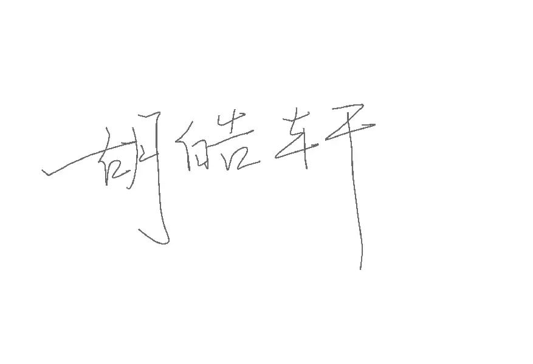

# 《AI 协作契约》

## 第一条：AI 使用原则

- AI 是工具，工程师/使用人是责任主体
- 所有 AI 输出必须经过至少一人的人工审查后才能合入项目

## 第二条：AI 使用范围

- **允许使用 AI 的场景：**
  - 生成调研问卷初稿、访谈提纲初稿（基于课程统一框架补充细节）；
  - 按指定 Prompt 生成 IEEE 830 格式的需求规格说明书初稿；
  - 生成用例图草稿（含角色、基础用例）、用户故事初稿；
  - 辅助整理调研数据（如问卷结果的基础分类、访谈笔记的关键词提取）；
  - 解释 IEEE 830 规范、MoSCoW 优先级方法等专业概念；
  - 生成 Git 仓库基础配置文件（.gitignore、README.md 初稿）。

- **禁止直接使用 AI 输出（需额外审查）的场景：**
  - AI 生成的需求规格说明书终版（必须结合人工调研结果修改，每条需求标注来源并审查）；
  - AI 生成的用例描述（需补充异常流、验收标准，人工核对是否符合调研需求）；
  - AI 生成的用户故事（需完善验收标准，确保可测试、贴合真实用户场景）；
  - AI 生成的 “AI 需求盲区挑战” 对比分析内容（需人工核对 AI 输出与调研数据的一致性）；
  - AI 生成的非功能需求（性能、安全等，需结合校园场景人工调整，如 “响应时间≤2 秒” 需验证可行性）。

- **完全禁止使用 AI 的场景：**
  - AI 协作反思日志的全部内容（必须基于团队真实使用 AI 的体验手写，禁止 AI 生成或润色）；
  - 调研原始数据记录（问卷结果、访谈笔记需如实记录，禁止 AI 篡改或生成虚假数据）；
  - 需求评审的结论与问题记录（必须是团队内部交叉评审的真实结果，禁止 AI 代拟）；
  - 核心工程判断（如 “是否舍弃 AI 生成的‘校园卡支付’需求” 等决策，需人工讨论确定）；
  - Prompt 日志的记录（需如实复制与 AI 的交互 Prompt，禁止 AI 修改或生成 Prompt）。

## 第三条：过程记录要求

- 所有与 AI 的交互 Prompt 必须保留日志
- Git commit message 必须标注 `[AI-assisted]` 或 `[Human-written]`
- 每阶段填写《AI 协作反思日志》

## 第四条：代码合入规则

- AI 生成的代码必须通过至少一名团队成员的 Code Review
- 每位成员每个编码阶段至少有 2 个完全手写的核心函数
- 每人负责的代码部分单独备份留档，方便处理或还原

## 第五条：违约处理

- **团队内部约定的违约处理方式：**
  - 违规人在团队内其他至少一人的线下监督下重新按要求完成该部分内容；
  - 违规人需要承担因此造成的团队的时间损失或者对外解释需要。

---

**团队名称：** 不误正业

**团队成员签名：**
<table>
  <tr>
    <td align="center"><a href="https://github.com/snnbyyds"> <b>snnbyyds</b></a></td>
    <td align="center"><a href="https://github.com/nanchenwuyue"> <b>nanchenwuyue</b></a></td>
    <td align="center"><a href="https://github.com/HarrisonHuH"> <b>HarrisonHuH</b></a></td>
    <td align="center"><a href="https://github.com/lbb-and-a-little-rabbit"> <b>dtor</b></a></td>
  </tr>
</table>
**日期：** 2026年4月14日