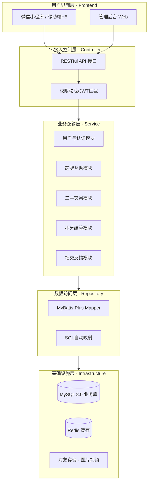

# 校园互助服务平台架构设计文档

---

## 1. 系统架构图

分层架构的核心原则是“单向依赖”，即上层可以调用下层，但下层不能调用上层。

### 架构层次说明：
*   **用户界面层 (Frontend/UI)：** 负责与学生交互，处理移动端或 H5 的页面渲染。
*   **接入/控制层 (Controller)：** 接收前端请求，进行参数校验和权限检查（如是否已登录）。
*   **业务逻辑层 (Service)：** 系统的“大脑”，处理复杂的业务规则（如积分扣除逻辑、跑腿订单状态流转）。
*   **数据访问层 (Repository/DAO)：** 负责与数据库“打交道”，执行增删改查操作。
*   **基础设施层 (Infrastructure/DB)：** 支撑系统运行的数据库、缓存及外部存储。

---

## 2. 模块划分

根据组员整理结果，系统将划分为以下核心模块：

| 模块名称 | 职责描述 | 关键功能点 |
| :--- | :--- | :--- |
| **用户与认证模块** | 身份安全保障 | 学号注册、学号实名认证、个人资料管理、隐私设置。 |
| **任务/跑腿模块** | 核心互助业务 | 发布任务（快递/外卖）、接单抢单、任务进度追踪。 |
| **二手与招领模块** | 物品流转业务 | 物品图片上传、分类搜索、留言咨询、交易状态修改。 |
| **积分与支付模块** | 价值激励系统 | 积分充值/兑换、酬劳中间人托管、任务完工结算。 |
| **社交与反馈模块** | 交流与信誉体系 | 在线即时聊天、互助评价评分、违规内容举报。 |
| **公共支撑模块** | 系统底层能力 | 图片上传存储、全站搜索、系统公告推送。 |

---

## 3. 技术选型

考虑到开发周期和校园项目的维护便利性，主要以下**主流且成熟**的技术栈：

### 3.1 后端技术栈 (Java 生态)
*   **核心框架：** Spring Boot 3.x (开箱即用，简化配置)
*   **安全框架：** Spring Security + JWT (处理学号认证与登录状态)
*   **持久层框架：** MyBatis Plus (快速生成 CRUD 代码，提高效率)
*   **数据库：** MySQL 8.0 (存储用户信息、订单、评价等核心数据)
*   **缓存：** Redis (用于存放登录 Token、热门搜索、高频访问的任务)

### 3.2 前端技术栈
*   **框架：** Vue.js 3 或 React
*   **UI 组件库：** Vant UI (专为移动端设计，非常适合校园互助这种手机端使用的场景)
*   **通信：** Axios (与后端接口对接)

### 3.3 部署与运维
*   **服务器：** 阿里云/腾讯云（学生优惠版）或 学校机房服务器 或 github静态托管
*   **文件存储：** 阿里云 OSS 或 腾讯云 COS (用于存储二手物品和失物招领的照片)

---

## 4. 关键流程设计：以“跑腿服务”为例

1.  **发布：** 学生在 **UI 层**填写任务，**Service 层**校验积分是否足够。
2.  **托管：** 确认发布后，**积分模块**暂时冻结对应积分（由中间人机制托管）。
3.  **接单：** 另一名学生在列表看到任务，点击接单，**DAO 层**更新任务状态为“进行中”。
4.  **交流：** 双方通过 **社交模块** 沟通细节。
5.  **结算：** 任务完成后，发布者确认，**Service 层**将冻结积分转入接单者账户。

---