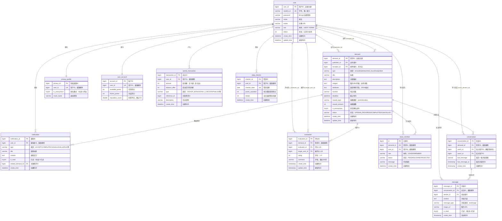

# 校园互助服务平台 — ER 图

> **版本**：2.0 | **最后更新**：2026-06-14
> 基于实际数据库 schema（Flyway V1–V11）

---

## 1. 实体关系图

---

## 2. 索引设计说明

| 表 | 索引名 | 索引列 | 类型 | 用途 |
|----|--------|--------|------|------|
| `user` | `uk_student_id` | `student_id` | UNIQUE | 学号登录高频查询，保证学号唯一 |
| `privacy_profile` | `uk_privacy_user_id` | `user_id` | UNIQUE | 用户与隐私配置一对一关联 |
| `user_account` | `uk_account_user_id` | `user_id` | UNIQUE | 用户与账户一对一关联 |
| `demand` | `idx_publisher` | `publisher_id` | INDEX | "我的发布"查询；与批量加载配合防 N+1 |
| `demand` | `idx_acceptor` | `acceptor_id` | INDEX | "我的接单"查询 |
| `demand` | `idx_type_status` | `type, status` | 复合 INDEX | 需求广场按类型+状态筛选（最常用查询） |
| `demand` | `idx_create_time` | `create_time` | INDEX | 按时间排序（首页最新需求） |
| `notification` | `idx_user_read` | `user_id, is_read` | 复合 INDEX | "我的未读通知"查询 |
| `notification` | `idx_create_time` | `create_time` | INDEX | 通知列表按时间排序 |
| `conversation` | `uk_demand_users` | `demand_id, user1_id, user2_id` | UNIQUE | 保证每对用户在同一需求下仅有一个会话 |
| `message` | `idx_conv_time` | `conversation_id, create_time` | 复合 INDEX | 会话消息按时间分页加载 |
| `evaluation` | `uk_demand_evaluator` | `demand_id, evaluator_id` | UNIQUE | 每人在每个需求下只能评价一次 |
| `team_member` | `uk_demand_user` | `demand_id, user_id` | UNIQUE | 同一用户在同一需求下只有一条组队记录 |
| `points_transaction` | `idx_tx_user` | `user_id` | INDEX | "我的积分明细"分页查询 |
| `points_transaction` | `idx_tx_time` | `create_time` | INDEX | 按时间排序积分流水 |
| `daily_checkin` | `uk_user_date` | `user_id, checkin_date` | UNIQUE | 每日签到唯一性约束 + 签到状态查询 |

---

## 3. 关键设计决策

### 3.1 单表继承（Single-Table Inheritance）

所有需求类型（跑腿、交易、组队、失物招领、学习互助、其他）共用一张 `demand` 表，通过 `type` 列（VARCHAR(32)）区分类型。类型特有字段存储在 `attributes`（TEXT，JSON 格式）列中。

**选择理由：**
- **查询简单**：需求列表无需跨表 JOIN，一条 `SELECT ... WHERE type=?` 即可
- **易于扩展**：新增需求类型只需在应用层添加验证逻辑，无需 ALTER TABLE
- **MyBatis-Plus 友好**：单一实体类映射，无需处理复杂的继承映射（MyBatis-Plus 不支持 JPA 继承注解）
- **避免 JOIN 开销**：相比类表继承（每种子类一张表），单表方案不存在多表 UNION 或 LEFT JOIN 的性能损耗

**权衡：**
- `attributes` 列中的 JSON 数据无法在数据库层做类型安全检查（由应用层 `DemandService.validateAttributes()` 保证）
- 所有类型共享同一表空间，极端情况下单表数据量大（校园场景可控）

### 3.2 JSON 属性列

`demand.attributes` 存储不同类型需求的特有字段，格式为 JSON 字符串：

| 需求类型 | attributes 示例 |
|----------|----------------|
| `errand` | `{"pickup_location":"韵达快递点"}` |
| `lost_found` | `{"lf_type":"LOST"}` 或 `{"lf_type":"FOUND"}` |
| `team` | `{"team_size":4,"team_type":"competition"}` |
| `trade` | `{"category":"教材","cash_price":0}` |
| `study` / `other` | `{}`（当前无特有字段） |

验证逻辑位于 `DemandServiceImpl.validateAttributes()`，按 `type` 分支检查必填字段和值域。

### 3.3 确定性会话 ID 排序

`conversation` 表始终保证 `user1_id < user2_id`（较小 ID 在前）。这一约束使得 `(demand_id, user1_id, user2_id)` 唯一索引可以正确防止同一对用户在同一个需求下创建重复会话，同时避免了 `(demand_id, LEAST(a,b), GREATEST(a,b))` 这类数据库函数索引的开销。

### 3.4 不可变积分账本

`points_transaction` 表作为只追加（append-only）的积分账本，每条记录包含变动后的余额快照（`balance_after`）。所有写操作使用 `SELECT ... FOR UPDATE` 悲观行锁，防止并发修改导致的余额不一致。积分流水不可删除、不可修改，保证审计可追溯。

---

## 4. 表清单速览

| # | 表名 | 用途 | 迁移版本 |
|---|------|------|----------|
| 1 | `user` | 用户认证与基本信息 | V1 |
| 2 | `privacy_profile` | 匿名模式与虚拟昵称 | V1 |
| 3 | `user_account` | 积分余额与信誉评分 | V1 |
| 4 | `demand` | 需求（全部6种类型，单表） | V2/V3/V7/V9 |
| 5 | `notification` | 系统通知 | V4 |
| 6 | `evaluation` | 交易评价（1-5星） | V5 |
| 7 | `conversation` | 聊天会话 | V6 |
| 8 | `message` | 聊天消息 | V6/V8 |
| 9 | `team_member` | 组队成员（含申请审批） | V10 |
| 10 | `points_transaction` | 积分流水账本（只追加） | V11 |
| 11 | `daily_checkin` | 每日签到记录 | V11 |
