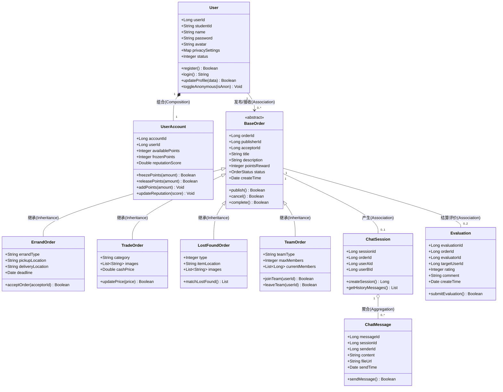

# SOLID 原则检查清单与修正方案

## AI生成类图

# 类图
---

## 1. 核心类定义（属性与方法）

### 👤 用户与认证模块 (User & Auth)

#### `User` (用户类)

* **属性**:
* `userId: Long` (用户ID，主键)
* `studentId: String` (学号，校内唯一认证) 

* `name: String` (姓名) 

* `password: String` (加密密码) 

* `avatar: String` (头像)
* `privacySettings: Map` (隐私设置：支持匿名/小号模式切换) 

* `status: Integer` (状态：正常/封禁) 

* **方法**:
* `register(): Boolean` (注册) 

* `login(): String` (登录，返回 JWT Token) 

* `updateProfile(data): Boolean` (更新个人资料) 

* `toggleAnonymous(isAnon): Void` (切换匿名状态) 

#### `UserAccount` (账户类)

* **属性**:
* `accountId: Long` (账户ID)
* `userId: Long` (关联用户ID)
* `availablePoints: Integer` (可用积分) 

* `frozenPoints: Integer` (冻结积分，用于中间人托管) 

* `reputationScore: Double` (信誉评分) 

* **方法**:
* `freezePoints(amount): Boolean` (冻结积分) 

* `releasePoints(amount): Boolean` (解冻并扣除积分) 

* `addPoints(amount): Void` (增加积分) 

* `updateReputation(score): Void` (更新信誉分) 

---

### 📦 互助业务模块 (Mutual Aid Business)

#### `BaseOrder` (基础订单抽象类)

* **属性**:
* `orderId: Long` (订单ID)
* `publisherId: Long` (发布者ID) 

* `acceptorId: Long` (接单者ID，可为空) 

* `title: String` (标题)
* `description: String` (详细描述) 

* `pointsReward: Integer` (积分报酬) 

* `status: OrderStatus` (状态枚举：已发布/进行中/待确认/已完成/已取消) 

* `createTime: Date` (创建时间)

* **方法**:
* `publish(): Boolean` (发布) 

* `cancel(): Boolean` (取消)
* `complete(): Boolean` (完成交易) 

#### `ErrandOrder` (跑腿订单类，继承 `BaseOrder`)

* **属性**:
* `errandType: String` (跑腿类型：快递代取/外卖代送/物品搬运) 

* `pickupLocation: String` (取件地点) 

* `deliveryLocation: String` (送达地点) 

* `deadline: Date` (截止时间) 

* **方法**:
* `acceptOrder(acceptorId): Boolean` (接单) 

#### `TradeOrder` (二手交易订单类，继承 `BaseOrder`)

* **属性**:
* `category: String` (商品分类) 

* `images: List<String>` (商品图片) 

* `cashPrice: Double` (可选：现金价格，满足部分用户对现金的需求) 

* **方法**:
* `updatePrice(price): Boolean` (修改价格)

#### `LostFoundOrder` (失物招领类，继承 `BaseOrder`)

* **属性**:
* `type: Integer` (类型：寻物/招领) 

* `itemLocation: String` (丢失/拾获地点)
* `images: List<String>` (物品图片) 

* **方法**:
* `matchLostFound(): List<LostFoundOrder>` (AI辅助失物匹配推荐) 

#### `TeamOrder` (组队匹配类，继承 `BaseOrder`)

* **属性**:
* `teamType: String` (组队类型：活动/课程/运动搭子) 

* `maxMembers: Integer` (人数上限)
* `currentMembers: List<Long>` (当前加入的用户ID列表)

* **方法**:
* `joinTeam(userId): Boolean` (加入队伍)
* `leaveTeam(userId): Boolean` (退出队伍)

---

### 💬 社交与反馈模块 (Social & Feedback)

#### `ChatSession` (聊天会话类)

* **属性**:
* `sessionId: Long` (会话ID)
* `orderId: Long` (关联的订单ID) 

* `userAId: Long` (发布者ID) 

* `userBId: Long` (接单者ID) 

* **方法**:
* `createSession(): Long` (开启会话) 

* `getHistoryMessages(): List<ChatMessage>` (获取历史记录) 

#### `ChatMessage` (聊天消息类)

* **属性**:
* `messageId: Long` (消息ID)
* `sessionId: Long` (所属会话ID)
* `senderId: Long` (发送者ID)
* `content: String` (文字内容) 

* `fileUrl: String` (图片或文件URL) 

* `sendTime: Date` (发送时间)

* **方法**:
* `sendMessage(): Boolean` (发送消息)

#### `Evaluation` (评价类)

* **属性**:
* `evaluationId: Long` (评价ID)
* `orderId: Long` (关联订单ID) 

* `evaluatorId: Long` (评价人ID) 

* `targetUserId: Long` (被评价人ID)
* `rating: Integer` (评分：1-5星) 

* `comment: String` (评语内容) 

* `createTime: Date` (评价时间)

* **方法**:
* `submitEvaluation(): Boolean` (提交评价) 

---

## 2. 类之间的关系说明

1. **组合关系 (Composition)**:
* `User` 与 `UserAccount` 是组合关系。一个用户必须拥有一个且仅有一个积分/信誉账户，账户随着用户的创建而创建，随着用户销毁而销毁。

2. **继承关系 (Inheritance/Generalization)**:
* `ErrandOrder` (跑腿)、`TradeOrder` (二手)、`LostFoundOrder` (失物招领)、`TeamOrder` (组队) 均继承自抽象基类 `BaseOrder` 。

3. **关联关系 (Association)**:
* `User` 与 `BaseOrder`: 存在双向关联。一个用户可以发布（Publisher）或接受（Acceptor）多个订单；一个订单对应一个发布者和一个接单者 。

* `BaseOrder` 与 `ChatSession`: 一对一关联。一个互助订单在接单后会建立一个专属的即时聊天会话来协调任务细节 。

* `BaseOrder` 与 `Evaluation`: 一对多关联。一个订单完成后，涉及的双方（发布者和接单者）可以互相提交评价 。

4. **聚合关系 (Aggregation)**:
* `ChatSession` 与 `ChatMessage`: 聚合关系。一个会话包含多条聊天消息，消息可以独立存在（作为历史记录归档），即使会话在前端被关闭或删除 。

---

## 3. 类图关系矩阵

## SOLID检查清单

| SOLID 原则 | 检查问题 | AI 设计是否违反 | 违反说明 | 修正方案 |
| :--- | :--- | :---: | :--- | :--- |
| **S - 单一职责** (Single Responsibility) | 有没有类承担了过多职责？ | **是 (Partially)** | `User` 类同时处理了**核心身份信息**、**登录注册认证逻辑**以及**隐私模式/小号切换**。随着后续“多因素身份验证（短信/邮箱）”的加入，该类会变得过于臃肿。 | 将认证和隐私逻辑剥离。引入独立的 `AuthService` 处理登录/注册/MFA 验证，引入 `PrivacyProfile` 处理小号与匿名映射，让 `User` 只保留核心属性。 |
| **O - 开闭原则** (Open/Closed) | 增需求类型是否需要修改现有代码？ | **否 (No)** | 互助业务采用了优秀的**继承体系**。`ErrandOrder`、`TradeOrder` 等均继承自抽象类 `BaseOrder`。如果未来要新增“学习互助”或“生活帮忙”等新业务，只需扩展新的子类，无需修改 `BaseOrder`。 | *无需修正*。当前基于 `BaseOrder` 的多态设计完美符合开闭原则，扩展性良好。 |
| **L - 里氏替换** (Liskov Substitution) | 子类是否可以替换父类使用？ | **是 (Partially)** | `LostFoundOrder`（失物招领）虽然继承了 `BaseOrder`，但需求文档明确指出它不涉及积分或酬劳结算（属于公益招领）；而父类中包含强校验的 `pointsReward` 属性和 `complete()` 结算方法，子类无法无缝替代父类行为，违反了里氏替换。 | 重构父类。将 `BaseOrder` 进一步抽象，拆分为包含积分结算的 `PaidOrder`（跑腿、二手）和纯信息流的 `InformationalOrder`（失物招领），确保子类能完美继承父类行为。 |
| **I - 接口隔离** (Interface Segregation) | 有没有接口太 "胖"，包含了不需要的方法？ | **是 (Partially)** | AI 目前直接使用了大胖类（如 `BaseOrder` 携带了所有订单操作）。虽然在类图中表现为方法，但在转化为后端 Service 接口时，若直接把所有订单的增删改查混在一起，会导致跑腿模块被迫依赖二手交易的 `updatePrice` 逻辑。 | 按照《架构设计文档》的**模块划分**，在 Service 层建立隔离的接口：定义 `ErrandService`、`TradeService`、`LostFoundService`，各模块只实现并注入自己需要的接口方法。 |
| **D - 依赖倒置** (Dependency Inversion) | 高层模块是否直接依赖了底层模块的具体实现？ | **否 (No)** | 从《架构设计文档》的分层架构来看，系统严格遵循”单向依赖”原则（Service -> Repository -> Infrastructure）。类图中的关系多为实体间的关联，只要在代码实现时高层 Service 依赖的是 DAO 层的接口而非具体实现，就不会违反。 | *无需修正*。只需确保在 Java 代码实现中，Service 层注入的是 `MyBatis-Plus` 的 `Mapper 接口`，而不是直接实例化的持久层数据库对象。 |

---

## 实际实现与 AI 设计的差异分析

> 本节为 v2.1 新增，将 AI 最初生成的类图设计（基于继承体系）与项目实际代码（基于单表鉴别器）进行对比，分析实际工程选择在 SOLID 原则上的表现。

### 差异 1：类表继承 → 单表鉴别器

| 维度 | AI 设计 | 实际实现 |
|------|---------|----------|
| 需求类型建模 | 抽象 `BaseOrder` + 5 个子类（`ErrandOrder`, `TradeOrder`, `TeamOrder`, `LostFoundOrder`） | 单表 `Demand`，`type` 列鉴别 + `attributes` JSON 列 |
| OCP 表现 | 新增类型 = 新增子类，无需改 `BaseOrder` | 新增类型 = 应用层扩展 `validateAttributes()` 分支，无需 ALTER TABLE |
| LSP 表现 | `LostFoundOrder` 继承后无法使用 `complete()` 积分结算，违反 LSP | 不存在子类替换，LSP 自然满足 |
| ISP 表现 | 需要在 Service 层拆分 `ErrandService` 等隔离接口 | 实际 Service 按功能模块拆分（`BadgeService`, `ReportService`, `FavoriteService`），接口隔离良好 |

**实际实现的选择理由**：MyBatis-Plus 不支持 JPA 继承注解，单表方案查询无跨表 JOIN、新增类型无需 DDL。虽然 AI 设计在抽象上更”面向对象”，但在 MyBatis-Plus 技术栈下单表鉴别器是更务实的工程选择。

### 差异 2：策略模式 → 务实分支

AI 设计规划了 `OrderMatchingStrategy` 策略接口 + `DistanceMatchingStrategy` / `AIMatchingStrategy` 实现。实际代码中未采用，需求类型验证仅涉及 2-3 个字段检查，`if/else if` 分支比策略模式更直观。同时 `BadgeDefinition` 枚举用数据驱动替代策略：
- 9 种徽章定义集中在单个枚举中（key、名称、emoji、描述、目标值、隐藏标志）
- `BadgeServiceImpl.checkNewBadges()` 遍历所有枚举检测条件
- 新增徽章只需添加一个枚举值 + 条件检测分支

### 差异 3：观察者模式 → 直接调用

AI 设计规划了 `OrderStatusObserver` 观察者接口。实际代码中订单状态变更仅联动 2-3 个服务，直接同步调用（`notificationService.notifyXxx()` → `pointsService.transferOnComplete()`）比事件总线更直观，调试链路更短。

### 实际实现 SOLID 总体评价

| 原则 | 实际表现 | 说明 |
|------|----------|------|
| **S** | ✅ 良好 | 新增 `BadgeService`, `ReportService`, `FavoriteService`, `AdminService` 各自职责单一 |
| **O** | ✅ 良好 | 新增 `study`/`other` 类型无需改表结构；`BadgeDefinition` 枚举扩展无需改 Service 核心逻辑 |
| **L** | ✅ 满足 | 无继承体系，不存在子类替换父类场景 |
| **I** | ✅ 良好 | Service 接口按模块隔离，`ReportService` 不依赖 `BadgeService` 的方法 |
| **D** | ✅ 良好 | 所有 Service 通过构造函数注入 Mapper 接口，无直接依赖具体实现 |

> **工程判断**：在校园场景的用户量和功能规模下，简单的直接调用优于过早抽象。保持代码可读性和调试效率是更务实的选择。