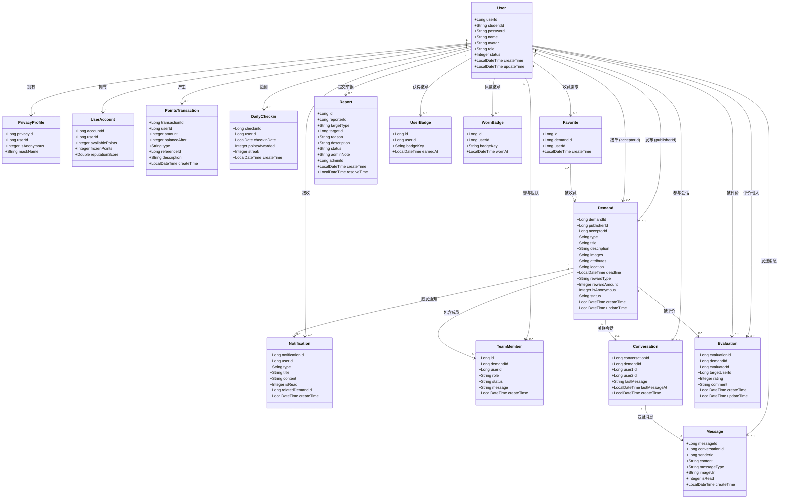

# 校园互助服务平台 — 类图

> **版本**：2.1 | **最后更新**：2026-06-16
> 基于实际后端实体类（MyBatis-Plus POJO），覆盖 V1–V14 迁移

---

## 1. 模块概述

系统实体分为四个模块：

| 模块 | 实体 | 说明 |
|------|------|------|
| 用户与认证 | `User`, `PrivacyProfile`, `UserAccount` | 用户身份、隐私配置、积分账户 |
| 需求业务 | `Demand`, `TeamMember` | 需求发布（单表多类型）、组队成员管理 |
| 聊天社交 | `Conversation`, `Message`, `Notification`, `Evaluation` | 即时通讯、系统通知、交易评价 |
| 积分系统 | `PointsTransaction`, `DailyCheckin` | 积分账本流水、每日签到 |
| 收藏与举报 | `Favorite`, `Report` | 需求收藏/书签、内容举报与审核 |
| 成就徽章 | `UserBadge`, `WornBadge` | 9 种成就徽章的获得与佩戴 |

---

## 2. 实体定义

### 2.1 用户与认证模块

#### `User`（用户）

| 字段 | 类型 | 说明 |
|------|------|------|
| `userId` | `Long` | 用户ID，自增主键 |
| `studentId` | `String` | 学号，唯一索引 |
| `password` | `String` | BCrypt 加密密码 |
| `name` | `String` | 显示姓名 |
| `avatar` | `String` | 头像 URL |
| `role` | `String` | 角色：`USER` / `ADMIN` |
| `status` | `Integer` | 状态：1正常 / 0封禁 |
| `createTime` | `LocalDateTime` | 创建时间（DB 管理） |
| `updateTime` | `LocalDateTime` | 更新时间（DB 管理） |

#### `PrivacyProfile`（隐私配置）

| 字段 | 类型 | 说明 |
|------|------|------|
| `privacyId` | `Long` | 隐私配置ID |
| `userId` | `Long` | 关联用户ID（一对一） |
| `isAnonymous` | `Integer` | 匿名模式：0关闭 / 1开启 |
| `maskName` | `String` | 虚拟昵称（匿名时对外展示） |

#### `UserAccount`（积分账户）

| 字段 | 类型 | 说明 |
|------|------|------|
| `accountId` | `Long` | 账户ID |
| `userId` | `Long` | 关联用户ID（一对一） |
| `availablePoints` | `Integer` | 可用积分 |
| `frozenPoints` | `Integer` | 冻结积分（发布需求时托管） |
| `reputationScore` | `Double` | 信誉评分，默认 5.0 |

---

### 2.2 需求业务模块

#### `Demand`（需求 — 单表六类型）

| 字段 | 类型 | 说明 |
|------|------|------|
| `demandId` | `Long` | 需求ID，自增主键 |
| `publisherId` | `Long` | 发布者ID |
| `acceptorId` | `Long` | 接单者ID，可为空 |
| `type` | `String` | **类型鉴别器**：`errand` / `trade` / `team` / `lost_found` / `study` / `other` |
| `title` | `String` | 标题 |
| `description` | `String` | 详细描述 |
| `images` | `String` | 图片URL列表（逗号分隔或JSON数组） |
| `attributes` | `String` | **JSON列**：类型特有字段 |
| `location` | `String` | 地点信息 |
| `deadline` | `LocalDateTime` | 截止时间 |
| `rewardType` | `String` | 报酬类型：`point` / `donation` |
| `rewardAmount` | `Integer` | 报酬数额 |
| `isAnonymous` | `Integer` | 是否匿名发布：0否 / 1是 |
| `status` | `String` | 状态：`OPEN` → `IN_PROGRESS` → `COMPLETED` / `CANCELLED` |
| `createTime` | `LocalDateTime` | 创建时间 |
| `updateTime` | `LocalDateTime` | 更新时间 |

> **类型鉴别器模式**：不采用 JPA 类表继承，而是用 `type` 列区分需求类型，`attributes`（JSON TEXT）存储类型特有字段。业务层通过 `DemandService.validateAttributes()` 按类型分支校验。

#### `TeamMember`（组队成员）

| 字段 | 类型 | 说明 |
|------|------|------|
| `id` | `Long` | 记录ID，自增主键 |
| `demandId` | `Long` | 关联需求ID |
| `userId` | `Long` | 用户ID |
| `role` | `String` | 角色：`LEADER` / `MEMBER` |
| `status` | `String` | 状态：`PENDING`（待审批）/ `JOINED`（已加入）/ `REJECTED`（已拒绝） |
| `message` | `String` | 申请留言 |
| `createTime` | `LocalDateTime` | 创建时间 |

---

### 2.3 聊天社交模块

#### `Conversation`（聊天会话）

| 字段 | 类型 | 说明 |
|------|------|------|
| `conversationId` | `Long` | 会话ID |
| `demandId` | `Long` | 关联需求ID |
| `user1Id` | `Long` | 较小用户ID（确定性排序） |
| `user2Id` | `Long` | 较大用户ID |
| `lastMessage` | `String` | 最后一条消息快照（最多500字） |
| `lastMessageAt` | `LocalDateTime` | 最后消息时间 |
| `createTime` | `LocalDateTime` | 创建时间 |

#### `Message`（聊天消息）

| 字段 | 类型 | 说明 |
|------|------|------|
| `messageId` | `Long` | 消息ID |
| `conversationId` | `Long` | 所属会话ID |
| `senderId` | `Long` | 发送者ID |
| `content` | `String` | 消息正文 |
| `messageType` | `String` | 类型：`text` / `image` |
| `imageUrl` | `String` | 图片URL（图片消息时使用） |
| `isRead` | `Integer` | 已读标记：0未读 / 1已读 |
| `createTime` | `LocalDateTime` | 发送时间 |

#### `Notification`（系统通知）

| 字段 | 类型 | 说明 |
|------|------|------|
| `notificationId` | `Long` | 通知ID |
| `userId` | `Long` | 接收者ID |
| `type` | `String` | 类型：`ACCEPT` / `COMPLETE` / `CANCEL` / `EVALUATION` / `JOIN_REQUEST` / `REQUEST_APPROVED` / `REQUEST_REJECTED` |
| `title` | `String` | 通知标题 |
| `content` | `String` | 通知正文 |
| `isRead` | `Integer` | 已读：0未读 / 1已读 |
| `relatedDemandId` | `Long` | 关联需求ID |
| `createTime` | `LocalDateTime` | 创建时间 |

#### `Evaluation`（交易评价）

| 字段 | 类型 | 说明 |
|------|------|------|
| `evaluationId` | `Long` | 评价ID |
| `demandId` | `Long` | 关联需求ID |
| `evaluatorId` | `Long` | 评价人ID |
| `targetUserId` | `Long` | 被评价人ID |
| `rating` | `Integer` | 评分：1-5 |
| `comment` | `String` | 评语，最长500字 |
| `createTime` | `LocalDateTime` | 创建时间 |
| `updateTime` | `LocalDateTime` | 更新时间 |

---

### 2.4 积分系统模块

#### `PointsTransaction`（积分流水）

| 字段 | 类型 | 说明 |
|------|------|------|
| `transactionId` | `Long` | 流水ID |
| `userId` | `Long` | 用户ID |
| `amount` | `Integer` | 变动额（正=收入，负=支出） |
| `balanceAfter` | `Integer` | 变动后可用余额快照 |
| `type` | `String` | 类型：`SIGNUP_BONUS` / `DAILY_CHECKIN` / `PUBLISH` / `CANCEL_REFUND` / `COMPLETE_EARN` / `ADMIN_ADJUST` |
| `referenceId` | `Long` | 关联需求ID |
| `description` | `String` | 可读说明 |
| `createTime` | `LocalDateTime` | 创建时间 |

#### `DailyCheckin`（每日签到）

| 字段 | 类型 | 说明 |
|------|------|------|
| `checkinId` | `Long` | 签到ID |
| `userId` | `Long` | 用户ID |
| `checkinDate` | `LocalDate` | 签到日期（不含时间） |
| `pointsAwarded` | `Integer` | 本次签到获得积分 |
| `streak` | `Integer` | 当日连续签到天数 |
| `createTime` | `LocalDateTime` | 创建时间 |

---

### 2.5 收藏与举报模块

#### `Favorite`（需求收藏）

| 字段 | 类型 | 说明 |
|------|------|------|
| `id` | `Long` | 收藏ID，自增主键 |
| `demandId` | `Long` | 需求ID（FK→demand，级联删除） |
| `userId` | `Long` | 用户ID（FK→user，级联删除） |
| `createTime` | `LocalDateTime` | 收藏时间 |

#### `Report`（举报）

| 字段 | 类型 | 说明 |
|------|------|------|
| `id` | `Long` | 举报ID，自增主键 |
| `reporterId` | `Long` | 举报人ID |
| `targetType` | `String` | 举报目标类型：`DEMAND` / `USER` / `MESSAGE` |
| `targetId` | `Long` | 举报目标ID（多态外键） |
| `reason` | `String` | 举报原因：`MISLEADING` / `HARASSMENT` / `ILLEGAL` / `SPAM` / `OTHER` |
| `description` | `String` | 补充说明（可选，最长512字） |
| `status` | `String` | 状态：`PENDING` / `RESOLVED` / `DISMISSED` |
| `adminNote` | `String` | 管理员处理备注 |
| `adminId` | `Long` | 处理管理员ID |
| `createTime` | `LocalDateTime` | 举报时间 |
| `resolveTime` | `LocalDateTime` | 处理时间 |

---

### 2.6 成就徽章模块

#### `UserBadge`（已获得徽章）

| 字段 | 类型 | 说明 |
|------|------|------|
| `id` | `Long` | 记录ID，自增主键 |
| `userId` | `Long` | 用户ID（FK→user，级联删除） |
| `badgeKey` | `String` | 徽章标识，如 `FIRST_PUBLISH` |
| `earnedAt` | `LocalDateTime` | 获得时间 |

#### `WornBadge`（当前佩戴徽章）

| 字段 | 类型 | 说明 |
|------|------|------|
| `id` | `Long` | 记录ID，自增主键 |
| `userId` | `Long` | 用户ID（UK，FK→user，级联删除） |
| `badgeKey` | `String` | 当前佩戴的徽章 key |
| `wornAt` | `LocalDateTime` | 佩戴时间 |

#### `BadgeDefinition`（徽章定义枚举 — 非数据库实体）

| key | 名称 | emoji | 描述 | 目标值 | 隐藏条件 |
|-----|------|-------|------|--------|----------|
| `FIRST_PUBLISH` | 首次发布 | 🎉 | 发布第一个需求 | 1 | — |
| `FIRST_ACCEPT` | 首次接单 | 🤝 | 接受第一个需求 | 1 | — |
| `TEN_COMPLETES` | 十全十美 | 🏆 | 完成10个需求 | 10 | — |
| `FIRST_FIVE_STAR` | 五星好评 | ⭐ | 首次获得5星评价 | 1 | — |
| `HUNDRED_STARS` | 百星好评 | 💯 | 累计获得100颗星 | 100 | — |
| `CHECKIN_30` | 签到达人 | 🔥 | 连续签到30天 | 30 | — |
| `HELPER` | 乐于助人 | 💝 | 完成5个捐赠型需求 | 5 | — |
| `FIRST_REPORT_SUCCESS` | 正义使者 | 🛡️ | 首次举报被确认处理 | 1 | — |
| `EASTER_EGG` | 彩蛋猎人 | 🐱 | 触发隐藏彩蛋 | 1 | ✅ |

---

## 3. 类关系图

---

## 4. 类型鉴别器模式详解

### 4.1 设计思路

`Demand` 实体采用**单表 + 类型鉴别器 + JSON 属性**模式，而非传统的类表继承：

- **`type` 列**（VARCHAR(32)）作为鉴别器，取值 `errand` / `trade` / `team` / `lost_found` / `study` / `other`
- **`attributes` 列**（TEXT，存储 JSON 字符串）存放各类型特有字段
- **共享字段**（`title`, `description`, `location`, `deadline`, `rewardType`, `rewardAmount` 等）所有类型共用

### 4.2 attributes JSON 格式

| type | attributes 示例 | 含义 |
|------|----------------|------|
| `errand` | `{"pickup_location":"韵达快递点"}` | 跑腿取件地点 |
| `lost_found` | `{"lf_type":"LOST"}` | 寻物(LOST) 或 招领(FOUND) |
| `team` | `{"team_size":4,"team_type":"competition"}` | 队伍人数上限、组队类别 |
| `trade` | `{}` | 二手交易通用字段已覆盖 |
| `study` | `{}` | 暂无特有字段 |
| `other` | `{}` | 暂无特有字段 |

### 4.3 选择理由

- **MyBatis-Plus 兼容**：MyBatis-Plus 不支持 JPA 的 `@Inheritance` / `@DiscriminatorColumn` 注解，单表映射最自然
- **查询简洁**：需求列表 `SELECT * FROM demand WHERE type=? AND status=?`，无跨表 JOIN
- **扩展灵活**：新增需求类型（如 `study`）无需 ALTER TABLE，仅需在应用层添加验证规则
- **需求广场统一排序**：所有类型在同一列表中混合展示时，不需要 UNION 多表

---

## 5. 设计模式应用

实际代码中使用的设计模式（与最初设计文档中策略/观察者的规划不同，工程实现选择了更务实的方案）：

### 5.1 单表继承模式（Single-Table Inheritance）

**应用位置**：数据库层 — `demand` 表 + `Demand` 实体

**解决的问题**：六种互助需求类型共享核心字段，但又有各自的特有属性。单表继承避免了复杂的多表 JOIN 和 MyBatis-Plus 不支持的 JPA 继承映射。

**不使用此模式的后果**：类表继承需要 5 张以上的表（`base_order`, `paid_order`, `errand_order`, `trade_order`, `team_order`, `lost_found_order`），需求广场列表需要跨 5 表 UNION + JOIN，查询复杂度显著上升。

### 5.2 悲观锁模式（Pessimistic Locking）

**应用位置**：`PointsServiceImpl.freezeOnPublish()` / `unfreezeOnCancel()` / `transferOnComplete()`

**解决的问题**：积分冻结、解冻、转账操作涉及 `user_account.available_points` 和 `frozen_points` 的加减，高并发下可能出现余额不一致。使用 `SELECT ... FOR UPDATE` 行锁保证同一用户的积分操作串行化执行。

**不使用此模式的后果**：并发接单/取消场景下可能出现积分余额为负或冻结金额不匹配的数据不一致问题，积分账本的可信度无法保证。

### 5.3 批量加载模式（Batch Loading）

**应用位置**：`DemandServiceImpl.list()` — 使用 `userMapper.selectBatchIds()` 一次性加载所有发布者信息

**解决的问题**：需求列表展示时需要显示发布者姓名/头像。若逐条查询（N+1），30 条需求会产生 30 次额外数据库查询。批量加载将所有发布者 ID 收集后一次查询，消除 N+1 问题。

**不使用此模式的后果**：首页需求列表加载可能触发数十次额外数据库往返，响应时间随数据量线性增长。

### 5.4 确定性 ID 排序模式

**应用位置**：`ChatServiceImpl.getOrCreateConversation()` — 确保 `user1_id < user2_id`

**解决的问题**：两个用户在同一需求下的会话，无论谁先发起，在数据库中始终以同一对 `(user1_id, user2_id)` 存储。这使得 `UNIQUE(demand_id, user1_id, user2_id)` 约束可以正确防止重复会话创建。

**不使用此模式的后果**：需要使用 `LEAST()` / `GREATEST()` 函数索引或应用层去重逻辑，增加复杂度和出错概率。

---

## 6. 设计模式考量说明

最初详细设计文档（v1.0）中规划了**策略模式**（用于需求匹配推荐）和**观察者模式**（用于订单状态变更通知），但在实际实现中未采用，原因如下：

### 策略模式 → 未采用

需求类型的验证逻辑（`validateAttributes()`）在当前阶段足够简单——仅需检查 2-3 个字段的存在性和值域。六种类型的分支判断用 `if/else if` 即可清晰表达，无需引入策略接口 + 多个实现类 + 上下文工厂的间接层。若未来匹配算法显著复杂化（如引入 AI 语义匹配、地理位置距离计算），可以重构为策略模式而不影响调用方。

### 观察者模式 → 未采用

订单状态变更时需要触发的连带操作（通知发布者/接单者、积分结算）在当前规模下仅涉及 2-3 个服务。通过直接调用 `notificationService.notifyXxx()` 比事件总线更为直观，调试链路短。若未来状态变更需要联动更多模块（推送服务、邮件服务、审计日志），可以引入 Spring 事件机制（`ApplicationEventPublisher`）实现观察者模式。

> **工程判断**：在校园场景的用户量和功能规模下，简单的直接调用优于过早抽象。保持代码可读性和调试效率是更务实的选择。
